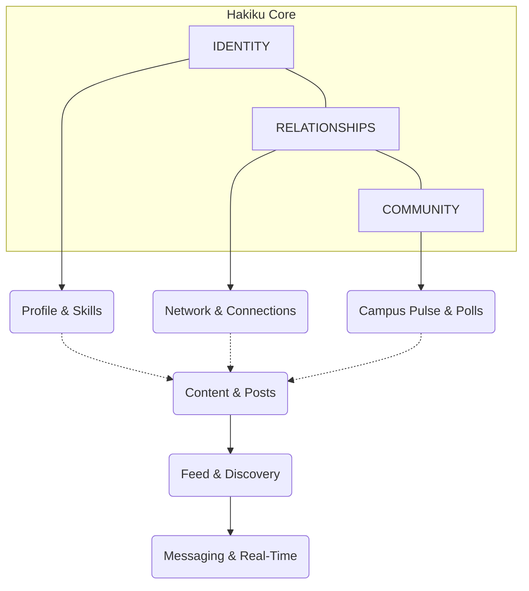
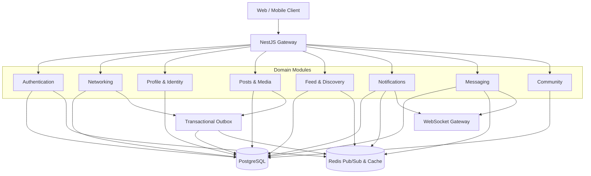
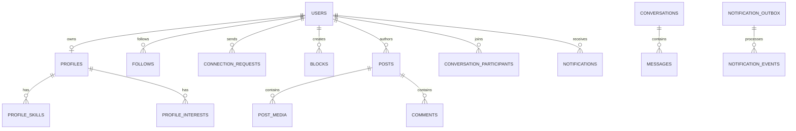

<div align="center">


# HAKIKU 
*(formerly SRM Connect)*

### The Social Infrastructure of Campus Life
**Connect. Discover. Create. Belong.**

<br>

[](https://github.com/Dhanas3kar/SRM-Connect)
[](https://nestjs.com/)
[](https://www.postgresql.org/)
[](https://redis.io/)
[](#real-time-infrastructure)
[](#performance-engineering)

<br>

> A campus-first social platform designed around student identity, meaningful connections, content, discovery, community, and real-time communication.

**[Explore the Repository](https://github.com/Dhanas3kar/SRM-Connect)**

</div>

---

## ✦ A Different Kind of Campus Platform

Hakiku is not another collection of student utilities. It is designed as a **social infrastructure layer for campus life** where identity, relationships, content, discovery, community, and messaging share one consistent security and data model.



---

## ✦ The Experience Modules

<div align="center">

| 🔍 DISCOVER | 🤝 CONNECT | ✍️ CREATE | 💬 COMMUNICATE |
|:---:|:---:|:---:|:---:|
| People discovery | Follow system | Rich Posts | 1-to-1 messaging |
| Personalized feed | Mutual connections | Media support | Real-time delivery |
| Campus discovery | Connection requests | Comments | Read receipts |
| Skill matching | Block controls | Likes | Conversation state |

</div>

---

## ✦ Product Surface

### 1. Identity 
A real student identity layer separated from authentication credentials. Features include avatars, academic context (department/batch), skills, interests, and visibility controls.

### 2. Network 
Relationships are explicit, queryable, and heavily protected. 
- **Follows:** Asymmetric updates.
- **Connections:** Symmetric, request-based network building.
- **Privacy:** Comprehensive block system with cascade cleanup and generic 404 isolation.

### 3. Content & Feed 
Posts support text, media (image/video), visibility controls (Public, Connections Only, Private), likes, and flat comments. The feed uses a deterministic ranking pipeline combining social and campus context.

### 4. Community 
Campus-native social experiences without turning Hakiku into an academic portal. Features include anonymous confessions, campus pulse activity, hot takes (polls), and people discovery.

---

## ✦ Architecture

Hakiku follows an advanced modular backend architecture where each product capability owns its domain logic while sharing common infrastructure.



---

## ✦ Data Model

The database is designed around explicit relationships rather than overloaded documents, utilizing **PostgreSQL** and **Drizzle ORM**.



---

## ✦ Real-Time Infrastructure

Hakiku utilizes two independent real-time domains, heavily backed by **Redis Pub/Sub** and **WebSocket** gateways, ensuring horizontal scalability.

> [!NOTE]  
> **Notification Reliability:** Hakiku implements a **Transactional Outbox Pattern**. Domain services write events to PostgreSQL, and a dedicated worker processes them for Redis delivery. This gives the notification system a durable source of truth even when the recipient is offline.

> [!IMPORTANT]  
> **Messaging Authorization:** Messaging is intentionally restricted. **Connection is required. Block overrides connection.**

---

## ✦ Security & Privacy Model

Security is not a separate layer added at the end. It is deeply embedded into each domain.

| Privacy Boundary | Enforced Behaviour |
|---|---|
| **Block** | Generic `404` isolation to prevent reconnaissance |
| **Suspended Account** | Mutations denied across all domains |
| **Banned Account** | Content entirely excluded from feeds |
| **Connections-Only Profile** | Full profile unlocked only for mutuals |
| **Connections-Only Post** | Visible strictly to mutual connections |
| **Messaging** | Active connection required to initiate/reply |

---

## ✦ Performance Engineering

The platform is designed around predictable, high-performance query behaviour. 

- **Cursor Pagination:** No deep `OFFSET` pagination. Composite cursors `(score DESC, created_at DESC, id DESC)` provide deterministic ordering.
- **N+1 Prevention:** Uses bounded batch hydration for profiles, media, and relationships.
- **Bounded Candidate Retrieval:** The feed engine retrieves bounded candidate windows, merges them, applies visibility, ranks them, then paginates.

### ⚡ Benchmark Verified (Concurrency: 500)
Recent load testing on the core API confirms high-throughput capabilities for write-heavy social workloads:

| Operation | Throughput | p99 Latency |
| :--- | :--- | :--- |
| **Create Post** | `~1,300 Req/s` | `~385ms` |
| **Toggle Like** | `~960 Req/s` | `~520ms` |
| **Send Message** | `~1,015 Req/s` | `~490ms` |

---

## ✦ Technology Stack

<div align="center">

| Category | Technology |
|:---|:---|
| **Core** | Node.js, TypeScript, NestJS, Fastify |
| **Database & ORM** | PostgreSQL, Drizzle ORM |
| **Caching & Pub/Sub** | Redis |
| **Real-Time** | WebSocket / Socket.IO |
| **Security** | JWT + Opaque refresh sessions, Argon2 |
| **Validation** | class-validator |
| **Testing** | Jest + Supertest (E2E) |
| **Infrastructure** | Docker |

</div>

---

## ✦ Development Guide

### Requirements
- Node.js
- Docker Desktop (PostgreSQL, Redis)
- npm

### Quick Start

```bash
# 1. Clone the repository
git clone https://github.com/Dhanas3kar/SRM-Connect.git
cd SRM-Connect

# 2. Install dependencies
npm install

# 3. Start infrastructure (DB & Cache)
docker compose up -d

# 4. Push database schema
npx drizzle-kit push

# 5. Run the API
npm run start:dev
```

### Quality Assurance
The system is built with regression testing as part of the development process. 
- Unit tests: `npm run test`
- E2E tests: `npm run test:e2e`

---

## ✦ Project Status

| Module | Status |
| :--- | :--- |
| **Authentication** | ✅ COMPLETE |
| **Networking** | ✅ COMPLETE |
| **Student Identity** | ✅ COMPLETE |
| **Posts & Media** | ✅ COMPLETE |
| **Feed & Discovery** | ✅ COMPLETE |
| **Notifications** | ✅ COMPLETE |
| **Real-Time Messaging** | ✅ COMPLETE |
| **Community** | 🏗️ IN PROGRESS |

---

<div align="center">

## HAKIKU

**A campus network built around people, not pages.**

Built with TypeScript, NestJS, PostgreSQL, Redis, and a security-first domain architecture.

</div>
