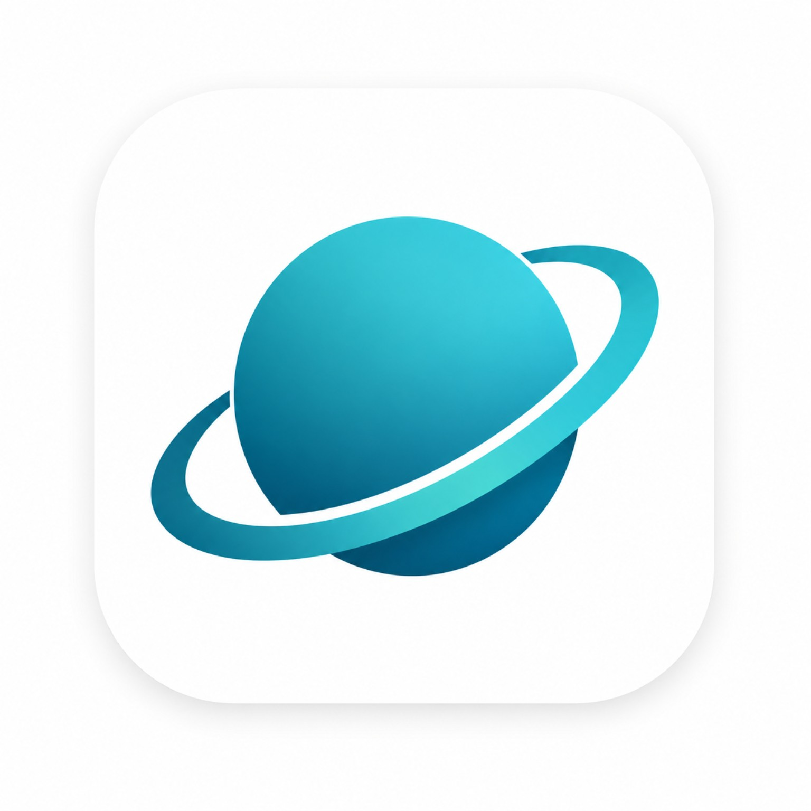
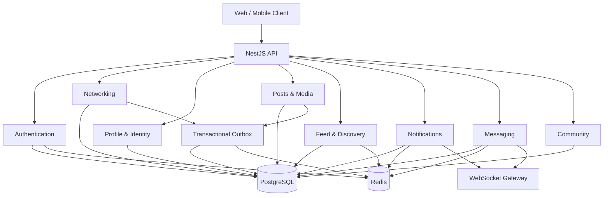
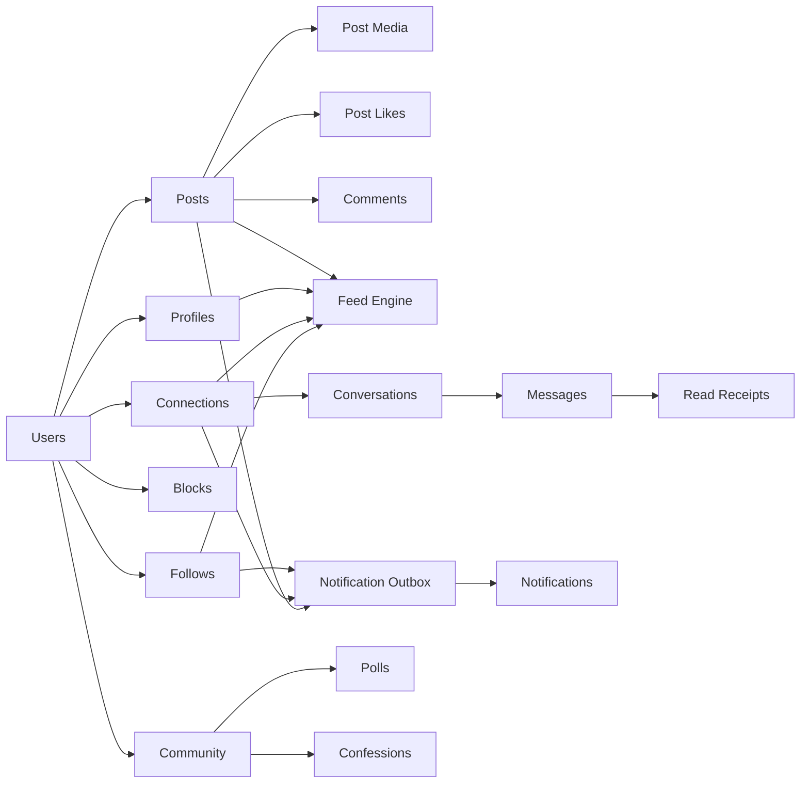
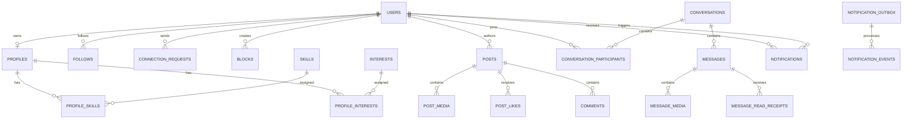
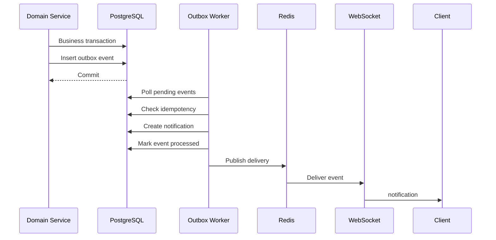
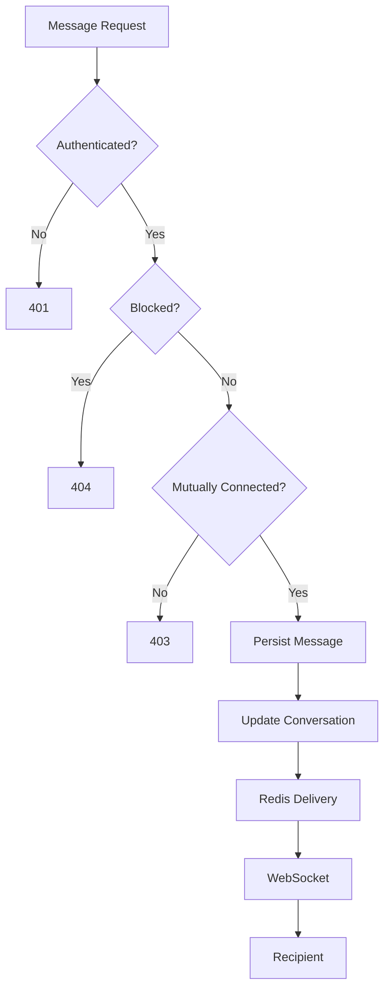

<div align="center">



# HAKIKU V1.0.0

### The Social Layer of Campus Life

**Connect. Discover. Create. Belong.**

<br>

[](https://github.com/Dhanas3kar/SRM-Connect)
[](https://nestjs.com/)
[](https://www.postgresql.org/)
[](https://redis.io/)
[](#real-time)
[](#quality)

<br>

> A campus-first social platform designed around student identity, meaningful connections, content, discovery, community and real-time communication.

<br>

**[Explore the Repository](https://github.com/Dhanas3kar/SRM-Connect)**

</div>

---

## A Different Kind of Campus Platform

SRM Connect is not another collection of student utilities.

It is designed as a **social infrastructure layer for campus life** where identity, relationships, content, discovery, community and messaging share one consistent security and data model.

```text
                         SRM CONNECT

       IDENTITY ──────── RELATIONSHIPS ──────── COMMUNITY
          │                    │                    │
          ▼                    ▼                    ▼
       PROFILE              NETWORK              POLLS
       SKILLS               FOLLOWS           CONFESSIONS
       INTERESTS            CONNECTIONS        CAMPUS PULSE
          │                    │                    │
          └────────────────────┼────────────────────┘
                               ▼
                            CONTENT
                               │
                 ┌─────────────┼─────────────┐
                 ▼             ▼             ▼
                POSTS         FEED        DISCOVERY
                 │             │             │
                 └─────────────┼─────────────┘
                               ▼
                           MESSAGING
                               │
                               ▼
                         REAL-TIME CAMPUS
```

---

## The Experience

<div align="center">

| DISCOVER | CONNECT | CREATE | COMMUNICATE |
|:---:|:---:|:---:|:---:|
| People discovery | Follow system | Posts | 1-to-1 messaging |
| Personalized feed | Mutual connections | Media | Real-time delivery |
| Campus discovery | Connection requests | Comments | Read receipts |
| Skill matching | Block controls | Likes | Conversation state |

</div>

---

## Product Surface

### Identity

A real student identity layer separated from authentication credentials.

```text
USER ACCOUNT
     │
     ▼
┌─────────────────────────────┐
│          PROFILE            │
├─────────────────────────────┤
│ username                    │
│ display name                │
│ campus / department         │
│ degree / batch              │
│ skills / interests          │
│ avatar / cover              │
│ visibility                  │
└─────────────────────────────┘
```

### Network

Relationships are explicit, queryable and protected.

```text
FOLLOW
  │
  ├── Following
  └── Followers

CONNECTION
  │
  ├── Request
  ├── Accept
  ├── Reject
  └── Remove

PRIVACY
  │
  └── Block
       ├── Cascade cleanup
       └── Generic 404 isolation
```

### Content

Posts support text, media, visibility controls, likes and flat comments.

```text
                         POST
                          │
             ┌────────────┼────────────┐
             ▼            ▼            ▼
           TEXT          MEDIA       VISIBILITY
                          │
                    ┌─────┴─────┐
                    ▼           ▼
                  IMAGE        VIDEO

             PUBLIC / CONNECTIONS_ONLY / PRIVATE
```

### Feed

A deterministic ranking pipeline combines social and campus context.

```text
CANDIDATES
    │
    ├── Followed users
    ├── Connections
    ├── Campus / academic context
    ├── Skill / interest overlap
    └── Public discovery
    │
    ▼
VISIBILITY FILTER
    │
    ├── Blocks
    ├── Account status
    ├── Soft deletion
    └── Post visibility
    │
    ▼
RANKING
    │
    ├── Relationship
    ├── Academic relevance
    ├── Skills / interests
    ├── Engagement
    └── Freshness
    │
    ▼
CURSOR PAGINATION
    │
    ▼
PERSONALIZED FEED
```

### Community

Phase 9 introduces campus-native social experiences without turning SRM Connect into an academic portal.

```text
┌──────────────────┐
│ CONFESSION HERO  │
│ Anonymous campus │
│ stories & voices │
└────────┬─────────┘
         │
         ├──────────────┐
         ▼              ▼
   CAMPUS PULSE     HOT TAKES
   activity         polls
         │              │
         └──────┬───────┘
                ▼
        PEOPLE DISCOVERY
                │
                ▼
         CAMPUS INSIGHTS
```

---

# Architecture

SRM Connect follows a modular backend architecture where each product capability owns its domain logic while sharing common infrastructure.



---

# Domain Architecture



---

# Data Model

The database is designed around explicit relationships rather than overloaded documents.



---

# Real-Time

SRM Connect uses two real-time domains.

```text
                     REAL-TIME LAYER
                           │
              ┌────────────┴────────────┐
              ▼                         ▼
       /notifications               /messages
              │                         │
              ▼                         ▼
        Notification               Messaging
          Gateway                  Gateway
              │                         │
              └────────────┬────────────┘
                           ▼
                         Redis
                           │
                    Pub/Sub Delivery
                           │
                           ▼
                       Connected
                         Clients
```

Notifications are persisted before delivery. Messaging uses connection authorization and block isolation before a message can cross the domain boundary.

---

# Notification Reliability

Phase 7 uses a transactional outbox rather than relying solely on in-memory events.



This gives the notification system a durable source of truth even when the recipient is offline.

---

# Messaging

Messaging is intentionally restricted to active mutual connections.



The authorization rule is simple by design:

**Connection is required. Block overrides connection.**

---

# Security Model

Security is not a separate layer added at the end. It is embedded into each domain.

```text
AUTHENTICATION
      │
      ▼
ACCOUNT STATUS
      │
      ├── ACTIVE
      ├── SUSPENDED
      ├── BANNED
      └── DEACTIVATED
      │
      ▼
RELATIONSHIP AUTHORIZATION
      │
      ├── Follow
      ├── Connection
      └── Block
      │
      ▼
RESOURCE VISIBILITY
      │
      ├── Public
      ├── Connections Only
      └── Private
      │
      ▼
DOMAIN ACTION
      │
      ├── Post
      ├── Comment
      ├── Message
      └── Notification
```

### Privacy Principles

| Boundary | Behaviour |
|---|---|
| Block | Generic `404` isolation |
| Suspended account | Mutations denied |
| Banned account | Content excluded |
| Deactivated account | Content excluded |
| Private profile | Owner/admin only |
| Connections-only profile | Full profile for connections |
| Connections-only post | Visible to mutual connections |
| Private post | Author only |
| Messaging | Active connection required |
| Notification | Block and preference suppression |

---

# Performance Engineering

The platform is designed around predictable query behaviour.

### Cursor Pagination

No feed, timeline or conversation relies on deep `OFFSET` pagination.

```text
(score DESC, created_at DESC, id DESC)
(created_at DESC, id DESC)
```

Composite cursors provide deterministic ordering even when records share timestamps.

### N+1 Prevention

```text
BAD

Post 1 ──► Profile query
Post 2 ──► Profile query
Post 3 ──► Profile query
...
Post N ──► Profile query


SRM CONNECT

Posts ───────────┐
Profiles ────────┤
Media ───────────┤──► Bounded batch hydration
Likes ───────────┤
Relationships ───┘
```

### Bounded Candidate Retrieval

The feed engine retrieves bounded candidate windows, merges them, applies visibility, ranks them, then paginates.

This keeps feed generation predictable as the dataset grows.

---

# Product Roadmap

```text
PHASE 01
Foundation
    │
    ▼
PHASE 02
Authentication & Security
    │
    ▼
PHASE 03
Networking
    │
    ▼
PHASE 04
Identity & Profiles
    │
    ▼
PHASE 05
Posts & Content
    │
    ▼
PHASE 06
Feed & Discovery
    │
    ▼
PHASE 07
Notifications & Real-Time Delivery
    │
    ▼
PHASE 08
Messaging & Conversations
    │
    ▼
PHASE 09
Community & Campus Culture
```

The architecture intentionally leaves room for future ranking improvements, richer moderation, group communication and additional campus-native experiences.

---

# Technology

<div align="center">

| Layer | Technology |
|:---|:---|
| Runtime | Node.js |
| Framework | NestJS |
| HTTP | Fastify |
| Language | TypeScript |
| Database | PostgreSQL |
| ORM | Drizzle ORM |
| Cache / Queue | Redis |
| Authentication | JWT + opaque refresh sessions |
| Real-Time | WebSocket / Socket.IO |
| Validation | class-validator |
| Testing | Jest + Supertest |
| Infrastructure | Docker |
| Media | StorageProvider abstraction |

</div>

---

# Repository Structure

```text
SRM-Connect/
│
├── apps/
│   └── api/
│       ├── src/
│       │   ├── auth/
│       │   ├── networking/
│       │   ├── profile/
│       │   ├── posts/
│       │   ├── feed/
│       │   ├── notifications/
│       │   ├── messaging/
│       │   ├── community/
│       │   └── db/
│       │
│       └── test/
│           ├── auth.e2e-spec.ts
│           ├── networking.e2e-spec.ts
│           ├── profile.e2e-spec.ts
│           ├── posts.e2e-spec.ts
│           ├── feed.e2e-spec.ts
│           ├── notifications.e2e-spec.ts
│           ├── messaging.e2e-spec.ts
│           └── community.e2e-spec.ts
│
├── docker-compose.yml
├── package.json
└── README.md
```

---

# Quality

The system is built with regression testing as part of the development process rather than as a final step.

```text
                  CHANGE
                    │
                    ▼
              UNIT TESTS
                    │
                    ▼
             BUILD / TYPECHECK
                    │
                    ▼
          DATABASE + REDIS E2E
                    │
                    ▼
          FULL REGRESSION SUITE
                    │
                    ▼
                 VERIFY
```

The current implementation has been validated across the completed phases with container-backed PostgreSQL and Redis integration tests.

---

# Development

## Requirements

```text
Node.js
Docker Desktop
PostgreSQL
Redis
npm
```

## Install

```bash
git clone https://github.com/Dhanas3kar/SRM-Connect.git
cd SRM-Connect
npm install
```

## Start infrastructure

```bash
docker compose up -d
```

## Database

```bash
npx drizzle-kit push
```

## Run API

```bash
npm run start:dev
```

## Unit tests

```bash
npm run test
```

## E2E tests

```bash
npm run test:e2e
```

## Build

```bash
npm run build
```

---

# Design Principles

### Identity is not authentication

Credentials belong to the security domain. Student identity belongs to the social domain.

### Relationships are explicit

Follow, connection and block states are represented independently so each can evolve without corrupting the others.

### Privacy is enforced server-side

The client never decides whether a resource is visible.

### Events must survive process failure

The notification outbox provides durable event processing instead of trusting an in-memory event alone.

### Real-time is an enhancement, not the source of truth

WebSocket delivery improves immediacy. PostgreSQL remains the persistent source of truth.

### Pagination must remain deterministic

Every high-volume collection uses stable cursor semantics.

### Product features must respect the social graph

Community, feed, profiles, posts and messaging all reuse the same relationship and privacy boundaries.

---

# Visual Identity

SRM Connect uses a dark-first visual language intended to feel closer to a modern social product than a conventional campus portal.

```text
┌─────────────────────────────────────────────────────────────┐
│                                                             │
│                         SRM                                 │
│                       CONNECT                               │
│                                                             │
│             A SOCIAL LAYER FOR CAMPUS                       │
│                                                             │
│                  DARK / LIGHT THEMES                        │
│                                                             │
└─────────────────────────────────────────────────────────────┘
```

The interface is designed around strong contrast, restrained surfaces, clear hierarchy and a visual system that can scale across desktop and mobile experiences.

---

# Project Status

```text
Authentication             COMPLETE
Networking                 COMPLETE
Student Identity           COMPLETE
Posts & Media              COMPLETE
Feed & Discovery           COMPLETE
Notifications              COMPLETE
Real-Time Messaging        COMPLETE
Community                  IN PROGRESS
```

---

<div align="center">

## SRM CONNECT

**A campus network built around people, not pages.**

<br>

[Repository](https://github.com/Dhanas3kar/SRM-Connect)

<br>

Built with TypeScript, NestJS, PostgreSQL, Redis and a security-first domain architecture.

</div>
