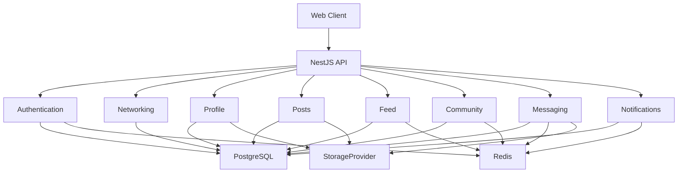
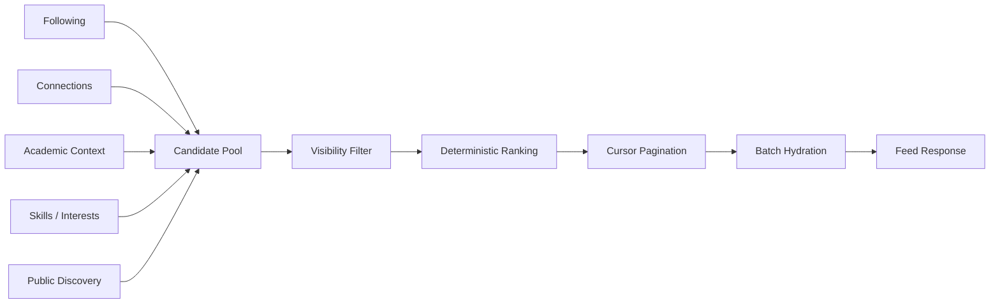
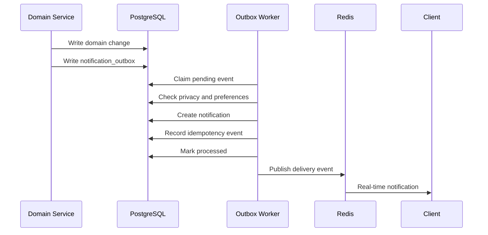
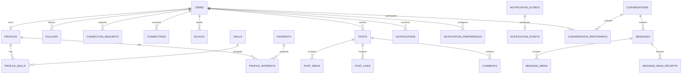

# SRM Connect

<p align="center">
  <strong>A private, student-first social network for the SRM ecosystem.</strong><br>
  <sub>Identity. Relationships. Content. Discovery. Community. Messaging.</sub>
</p>

<p align="center">
  <a href="https://github.com/Dhanas3kar/SRM-Connect"></a>
  
  
  
  
  
</p>

<p align="center">
  <a href="#product">Product</a> ·
  <a href="#architecture">Architecture</a> ·
  <a href="#capabilities">Capabilities</a> ·
  <a href="#security-model">Security</a> ·
  <a href="#development">Development</a> ·
  <a href="#roadmap">Roadmap</a>
</p>

---

## Product

SRM Connect is a dedicated digital social layer for students.

It is not intended to be another academic portal, generic social-media clone, or student resource directory. The product is built around a narrower question:

> What would a social network look like if the people, culture, conversations and opportunities of a university were the primary context?

The platform combines verified student identity, a relationship graph, privacy-aware content, personalized discovery, real-time communication and campus-native community features.

### Platform map

```text
                         SRM CONNECT
                              |
              +---------------+---------------+
              |                               |
        STUDENT IDENTITY                SOCIAL GRAPH
              |                               |
       Profile / Skills                Follow / Connect
       Interests / Campus              Block / Privacy
              |                               |
              +---------------+---------------+
                              |
                         CONTENT LAYER
                              |
             +----------------+----------------+
             |                |                |
            Posts            Feed          Discovery
             |                |                |
       Media / Likes      Ranking        People / Campus
       Comments           Cursor         Community
             |                |                |
             +----------------+----------------+
                              |
                       COMMUNICATION
                              |
                 +------------+------------+
                 |                         |
             Notifications             Messaging
                 |                         |
             Outbox / Redis           WebSockets
```

---

# Architecture

SRM Connect follows a modular domain-oriented backend architecture.



### Architectural principles

| Principle | Implementation |
|---|---|
| Domain separation | Independent NestJS modules and services |
| Authentication boundary | JWT, rotating sessions and secure cookies |
| Data integrity | PostgreSQL constraints and transactions |
| ORM | Drizzle ORM |
| Caching | Redis |
| Real-time | WebSocket gateways |
| Durable events | Transactional outbox |
| Media | StorageProvider abstraction |
| Pagination | Deterministic cursor pagination |
| Privacy | Centralized access and block checks |
| Testing | Unit plus PostgreSQL/Redis-backed E2E |

---

# Capabilities

## Authentication and session security

```text
Registration
     |
     v
OTP Verification
     |
     v
Authenticated Session
     |
     +---- Access JWT
     |
     +---- Rotating Refresh Session
     |
     v
Session Family
     |
     +---- ACTIVE
     +---- ROTATED
     +---- REVOKED
```

Includes OTP hashing, Redis throttling, refresh-token rotation, token-family reuse detection, audit logging and CSRF protection.

---

## Student identity

Authentication credentials and social identity are deliberately separated.

```text
users
 |
 +-- Authentication
 +-- Security status
 +-- Email verification
 +-- Sessions
 |
 +-------- profiles
             |
             +-- Username
             +-- Academic identity
             +-- Bio
             +-- Media
             +-- Visibility
             +-- Skills
             +-- Interests
```

Profiles support strict usernames, academic context, skills, interests, profile visibility, media and completion tracking.

---

## Social graph

```text
FOLLOW
A -----------------------> B

CONNECTION
A <======================> B

BLOCK
A - - - - - - - - - - -X B
```

Following is unidirectional. Connections are explicit bilateral relationships. Blocking is an overriding isolation mechanism that removes active social relationships and prevents future interaction.

### Connection state machine

```text
NONE
  |
  | request
  v
PENDING
  |
  +------ reject ------> REJECTED
  |
  +------ cancel ------> CANCELLED
  |
  +------ accept ------> CONNECTED
                             |
                             | remove
                             v
                           NONE
```

---

## Posts and media

Posts support text, images, video, likes, comments, visibility controls and soft deletion.

```text
POST
 |
 +-- content
 +-- visibility
 |
 +-- post_media[]
       |
       +-- IMAGE
       +-- VIDEO
```

Post visibility:

| Visibility | Access |
|---|---|
| `PUBLIC` | Active authenticated students |
| `CONNECTIONS_ONLY` | Author and mutual connections |
| `PRIVATE` | Author only |

Media validation uses MIME checks, size limits and magic-byte signatures before storage.

---

## Personalized feed

The feed is not a simple chronological list.



Ranking combines relationship strength, academic context, skill and interest overlap, engagement and freshness.

The retrieval architecture is separated from ranking so future ranking models can evolve without rewriting feed retrieval.

---

## Discovery

Discovery surfaces relevant students and public content using:

- Campus
- Department
- Batch
- Skills
- Interests
- Relationship state
- Public content

Candidate retrieval is bounded to avoid uncontrolled database scans.

---

## Notifications

Notifications use a transactional outbox rather than relying solely on in-memory events.



This provides durable processing, retries, idempotency, preference suppression, block-aware delivery and offline REST retrieval.

---

## Real-time messaging

Messaging is constrained by the relationship graph.

```text
                    Can A message B?
                           |
                           v
                 Is A connected to B?
                     /                              No             Yes
                   |               |
                  403              v
                              Is either blocked?
                                /                                      Yes         No
                               |           |
                              404          v
                                      MESSAGE ALLOWED
```

Messaging supports 1-to-1 conversations, WebSocket delivery, cursor pagination, unread tracking, read receipts, editing, soft deletion and media attachments.

---

## Community

The community layer is designed to make SRM Connect feel native to campus life.

### Confession Hero

A dedicated anonymous, short-lived campus surface for community moments.

```text
+-----------------------------------------------------------+
|                       CONFESSION HERO                     |
|                                                           |
|        "The library at 2 AM has its own ecosystem."       |
|                                                           |
|                         CAMPUS                            |
+-----------------------------------------------------------+
```

Public responses omit author identity while ownership remains available internally for moderation.

### People Worth Knowing

Recommendations based on mutual connections, shared skills, shared interests, department, campus and batch.

### Campus Pulse

A compact snapshot of recent platform activity.

### Campus Insights

Contextual statistics scoped to campus and academic context with privacy thresholds.

### SRM Hot Takes

Campus-native polls focused on opinions and participation.

### Community reporting

A unified reporting foundation for content and users.

---

# Security model

Security is a cross-cutting architectural concern.

```text
                 BLOCK
                   |
        +----------+----------+
        |                     |
     FOLLOW              CONNECTION
        |                     |
        +----------+----------+
                   |
                CONTENT
                   |
             NOTIFICATION
                   |
               MESSAGE
```

A block can override downstream social capabilities.

### Account states

```text
ACTIVE
  |
  +--> Normal interaction

SUSPENDED
  |
  +--> Mutations restricted
  +--> Content visibility restricted

BANNED
  |
  +--> Mutations denied
  +--> Content excluded

DEACTIVATED
  |
  +--> Mutations denied
  +--> Public content excluded
```

The backend consistently applies ownership checks, connection checks, bidirectional block checks, account-state checks, generic `404` responses where existence disclosure is unsafe, database uniqueness and transactional state transitions.

---

# Database architecture



Database integrity is enforced through foreign keys, composite primary keys, unique and partial indexes, check constraints, canonical ordering and transactions.

---

# Performance

The platform avoids the N+1 query pattern through bounded candidate retrieval and batch hydration.

```text
Candidate queries
       |
       v
Unique post IDs
Unique author IDs
       |
       +-------------------+
       |                   |
       v                   v
Batch profiles       Batch media
       |
       +-------------------+
       |                   |
       v                   v
Batch likes        Batch follows
       |
       v
Batch connections
       |
       v
Normalized response
```

Feed, notifications, relationships and messages use deterministic cursor pagination instead of offset pagination.

Example:

```json
{
  "createdAt": "2026-08-18T08:30:00.000Z",
  "id": "uuid"
}
```

Feed cursors additionally include the ranking score:

```json
{
  "score": 87.42,
  "createdAt": "2026-08-18T08:30:00.000Z",
  "id": "uuid"
}
```

Ordering remains deterministic:

```text
score DESC
    |
created_at DESC
    |
id DESC
```

---

# Repository structure

```text
SRM-Connect/
|
+-- apps/
|   |
|   +-- api/
|       |
|       +-- src/
|       |   +-- auth/
|       |   +-- networking/
|       |   +-- profile/
|       |   +-- posts/
|       |   +-- feed/
|       |   +-- notifications/
|       |   +-- messaging/
|       |   +-- community/
|       |   +-- db/
|       |   +-- main.ts
|       |
|       +-- test/
|
+-- packages/
|   +-- types/
|
+-- docker-compose.yml
+-- package.json
+-- package-lock.json
+-- .gitignore
+-- README.md
```

---

# Technology foundation

| Layer | Technology |
|---|---|
| Runtime | Node.js |
| Backend | NestJS |
| HTTP adapter | Fastify |
| Database | PostgreSQL |
| ORM | Drizzle ORM |
| Cache and delivery | Redis |
| Authentication | JWT + rotating sessions |
| Real-time | WebSockets / Socket.IO |
| Event processing | Transactional Outbox |
| Media | StorageProvider abstraction |
| Testing | Jest + infrastructure-backed E2E |
| Infrastructure | Docker Compose |

---

# API surface

| Domain | Routes |
|---|---|
| Authentication | `/auth/*` |
| Networking | `/networking/*` |
| Profiles | `/profile/*` |
| Skills | `/skills` |
| Interests | `/interests` |
| Posts | `/posts/*` |
| Feed | `/feed`, `/feed/discover` |
| Notifications | `/notifications/*` |
| Messaging | `/messages/*` |
| Community | `/confessions/*`, `/people/*`, `/campus/*`, `/polls/*` |

Each domain owns its DTOs, authorization rules and business services.

---

# Testing

SRM Connect uses unit and integration testing together.

```text
                 TEST PYRAMID

                    E2E
               +-----------+
               | PostgreSQL|
               |   Redis   |
               +-----------+
                    /                    /                 Integration
              +-----------+
                   /                   /                   Unit
          +---------------+
          | Domain Logic  |
          +---------------+
```

The integration suite uses real PostgreSQL and Redis infrastructure for critical workflows.

Important regression areas include authentication, relationship state transitions, block privacy, profile visibility, media ownership, post lifecycle, feed pagination, notification idempotency, messaging authorization, read receipts and community moderation.

---

# Development

## Prerequisites

- Node.js
- npm
- Docker Desktop

## Clone

```bash
git clone https://github.com/Dhanas3kar/SRM-Connect.git
cd SRM-Connect
```

## Install

```bash
npm install
```

## Environment

Create a local environment file from the example:

```bash
cp .env.example .env
```

PowerShell:

```powershell
Copy-Item .env.example .env
```

Never commit `.env`.

## Start infrastructure

```bash
docker compose up -d
docker compose ps
```

## Database

```bash
npx drizzle-kit push --force
```

For migration generation:

```bash
npx drizzle-kit generate
```

## Development

```bash
npm run dev
```

## Build

```bash
npm run build
```

## Unit tests

```bash
npm run test
```

## E2E tests

```bash
npm run test:e2e
```

---

# Engineering conventions

### Database changes

```text
Schema
  |
  v
Migration
  |
  v
Local verification
  |
  v
Unit tests
  |
  v
E2E regression
```

### Feature modules

Prefer:

```text
module/
|
+-- controller
+-- dto
+-- services
+-- guards / access
+-- validators
+-- tests
```

Keep unrelated business rules out of global services.

### Server-side authority

The client is never authoritative for:

- Identity
- Ownership
- Connection state
- Block state
- Visibility
- Notification ownership
- Media ownership
- Moderation permissions

---

# Roadmap

```text
PHASE 2   Authentication & Session Security        COMPLETE
    |
PHASE 3   Networking & Relationship Graph          COMPLETE
    |
PHASE 4   Student Identity & Profiles              COMPLETE
    |
PHASE 5   Posts, Media & Interactions               COMPLETE
    |
PHASE 6   Feed, Discovery & Infinite Scroll        COMPLETE
    |
PHASE 7   Notifications & Real-Time Delivery       COMPLETE
    |
PHASE 8   Messaging & Conversations                COMPLETE
    |
PHASE 9   Community & Campus Culture                ACTIVE
    |
PHASE 10  Future Platform Expansion                  NEXT
```

Each phase builds on explicit contracts from the previous phase rather than introducing hidden coupling.

---

# Design philosophy

### Student context over generic mechanics

The platform should feel native to campus life rather than being a generic social network with an SRM identity layer.

### Privacy is structural

Blocks, visibility, account state and ownership are enforced at service and database boundaries.

### Relationships are first-class data

Following, connections and blocking are independent primitives with explicit state transitions.

### Real-time does not mean memory-only

Important events are persisted through the outbox architecture before real-time delivery.

### Pagination must be deterministic

Feeds, messages, notifications and relationship lists should not depend on fragile offset pagination.

### Storage should remain replaceable

Local media storage is an implementation detail rather than a permanent cloud-provider dependency.

### The system should be able to evolve

Feed ranking, notification processing, media storage and real-time infrastructure are decoupled so they can be scaled or replaced independently.

---

# Verification baseline

Before merging a substantial feature:

```bash
npm run build
npm run test
npm run test:e2e
```

A phase is not considered complete merely because its isolated tests pass. Existing platform functionality must continue to pass the regression suite.

---

# Contributing

For feature work:

1. Create a dedicated branch.
2. Keep changes scoped to the relevant domain.
3. Add or update unit tests.
4. Add E2E coverage for externally observable behavior.
5. Verify database changes.
6. Run the complete regression suite.
7. Keep secrets and local infrastructure state out of Git.
8. Submit a focused pull request with architectural context.

---

# Security

If you discover a security issue, do not publish credentials, tokens, session data or exploit details in a public issue.

Report security concerns privately to the project maintainer with:

- Affected component.
- Reproduction conditions.
- Security impact.
- Suggested mitigation, if known.

Never commit:

```text
.env
private keys
access tokens
refresh tokens
database passwords
cloud credentials
production configuration
private user media
```

---

# License

License information should be added once the project's licensing decision is finalized.

Until then, the repository should not imply permissions that have not been explicitly granted.

---

<p align="center">
  <strong>SRM Connect</strong><br>
  <sub>A campus-native social infrastructure for students.</sub>
</p>

<p align="center">
  <a href="https://github.com/Dhanas3kar/SRM-Connect">View Repository</a>
</p>
